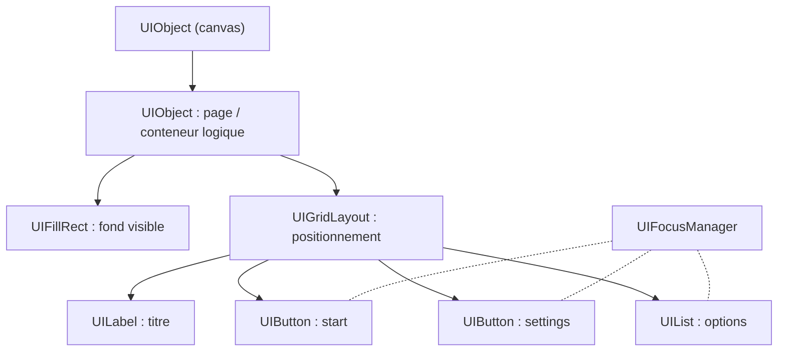
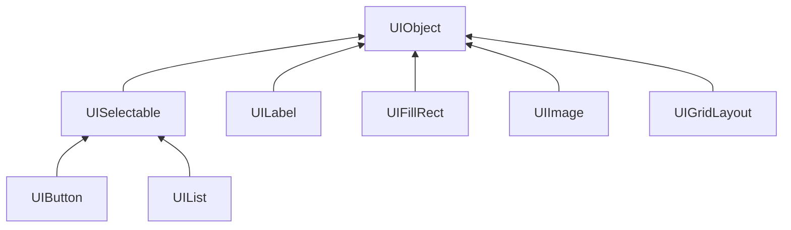

Guide d'utilisation des UIObjects du moteur
===========================================

Ce document décrit comment utiliser les UIObjects fournis par le moteur pour construire des interfaces utilisateur complètes.
L'objectif est pratique : montrer comment composer des pages, organiser les éléments et gérer la navigation entre les éléments interactifs et les différentes pages.

--------------------------------
# Principe général

La gestion de l'interface utilisateur est déléguée au UIManager.
Ce dernier est en charge d'ouvrir ou fermer des pages. On trouve un manager pour chacune des scènes du jeu : `TitleUIManager` pour le menu principal et `LevelUIManager` pour les niveaux.

Une page est formée d'un arbre d'objets dont la racine est un `UIObject` appelé **canvas**.
Parmi les objets disponibles, on retrouve, entre autres, des **GridLayout** pour positionner facilement les éléments, des **Labels** pour rédiger des textes, des **Buttons** ou des **Lists** pour sélectionner des options.

Chaque élément que vous utilisez est fourni sous la forme d'une structure prête à l'emploi ; votre rôle est d'instancier ces structures, de configurer leurs propriétés et de les attacher à l'arbre.
Lors d'une interaction de l'utilisateur avec une liste ou un bouton, un **callback** enregistré est appelé avec les données associées à l'élément sélectionné.
Le traitement consiste à appliquer directement l'action demandée : ouvrir une nouvelle page, changer une valeur dans les paramètres etc.

## Architecture d'une page

Le schéma ci-dessous présente l'organisation typique d'une page.
Elle est composée d'un conteneur logique (`UIObject`), d'un fond visible (`UIFillRect` ou `UIImage`) et d'un ensemble de **widgets** disposés par un conteneur de layout (`UIGridLayout`) ou positionnés directement. Le `UIFocusManager` gère automatiquement la navigation entre les éléments interactifs.


## Construction d'une page

La création d'une page suit généralement ces étapes :

1. **Initialisation** : allouer la structure de la page et récupérer les ressources nécessaires (`AssetManager`, `UISystem`, `Input`). Il est important de nettoyer l'état des entrées avec `Input_clearUIInput()` pour éviter que des actions du frame précédent ne soient interprétées.
2. **Création du conteneur principal** : créer un `UIObject` qui servira de racine pour la page et le placer sous le canvas.
3. **Création du `UIFocusManager`** : instancier le gestionnaire de focus pour la page.
4. **Positionnement** : pour positionner proprement plusieurs éléments, vous pouvez utiliser un `UIGridLayout` sous le conteneur : il vous évite des positionnements en dur et facilite l'adaptation aux différentes résolutions.
5. **Ajout des éléments** : créer et configurer les labels, boutons et listes.
6. **Configuration du style** : appliquer les styles visuels (couleurs, sprites) via les fonctions d'aide `UIStyle_setDefaultButton()` et `UIStyle_setDefaultList()`.
7. **Enregistrement des callbacks** : associer les fonctions de rappel aux éléments interactifs avec `UIButton_setOnClickCallback()` ou `UIList_setOnItemChangedCallback()`.
8. **Association des données utilisateur** : utiliser `UISelectable_setUserData()` pour passer un pointeur vers la structure de la page, qui sera accessible dans les callbacks.
9. **Enregistrement dans le focus manager** : ajouter les éléments interactifs avec `UIFocusManager_addSelectable()` et définir l'élément sélectionné par défaut avec `UIFocusManager_setFocused()`.

Voici un exemple type de création de page :

```c
MyPage* MyPage_create(GameContext* context, MyUIManager* manager)
{
    // 1. Récupération des ressources
    AssetManager* assets = GameContext_getAssetManager(context);
    UISystem* uiSystem = GameContext_getUISystem(context);
    UIObject* canvas = UISystem_getCanvas(uiSystem);
    Input_clearUIInput(GameContext_getInput(context));

    // Allocation de la structure
    MyPage* self = (MyPage*)calloc(1, sizeof(MyPage));
    ASSERT_NEW(self);
    self->m_context = context;
    self->m_uiManager = manager;

    // 2. Création du conteneur principal
    self->m_mainPanel = UIObject_create(uiSystem, "main-panel");
    UIObject_setParent(self->m_mainPanel, canvas);

    // 3. Création du focus manager
    self->m_focusManager = UIFocusManager_create(uiSystem);

    // 4. Positionnement avec GridLayout
    UIGridLayout* layout = UIGridLayout_create(uiSystem, "main-layout", 3, 1);
    UIObject_setParent(layout, self->m_mainPanel);
    UIGridLayout_setRowSizes(layout, 25.0f);
    UIGridLayout_setRowSpacings(layout, 5.f);

    // 5. Ajout d'un titre
    TTF_Font* font = AssetManager_getFont(assets, FONT_TITLE);
    UILabel* label = UILabel_create(uiSystem, "title-label", font);
    UILabel_setTextString(label, "My Page");
    UILabel_setAnchor(label, Vec2_anchor_center);
    UILabel_setColor(label, g_colors.white);
    UIGridLayout_addObject(layout, label, 0, 0, 1, 1);

    // 6. Création d'un bouton
    font = AssetManager_getFont(assets, FONT_NORMAL);
    UIButton* button = UIButton_create(uiSystem, "my-button", font);
    UIButton_setLabelString(button, "Click me");
    UIButton_setOnClickCallback(button, MyPage_onClick);
    UISelectable_setUserData(button, self);

    // 7. Application du style
    UIStyle_setDefaultButton(button, assets);

    UIGridLayout_addObject(layout, button, 1, 0, 1, 1);

    // 8. Enregistrement dans le focus manager
    UIFocusManager_addSelectable(self->m_focusManager, button);
    UIFocusManager_setFocused(self->m_focusManager, button);

    return self;
}
```

**Notes importantes** :
- Le conteneur logique `m_mainPanel` facilite la gestion de la page, en permettant sa destruction complète (en supprimant uniquement la racine) lors d'un changement de page.
- Si le conteneur principal doit être visible, ajoutez en enfant un `UIFillRect` ou une `UIImage` pour le fond.
- Le `UIFocusManager` calcule automatiquement la navigation en fonction des entrées de l'utilisateur et du positionnement actuel des éléments enregistrés.
- Il appelle aussi automatiquement les callbacks enregistrés sur les éléments lors des actions de l'utilisateur.

--------------------------------------------
# Rôles et usage des UIObjects

Chaque type d'objet a un usage bien défini.
- `UIObject` est un conteneur logique ; il sert à grouper et à activer/désactiver des sous-arbres et n'a pas forcément d'apparence visuelle.
- `UIFillRect` permet de créer un panneau de fond visible en contrôlant couleur et opacité. Il est souvent utilisé comme arrière-plan avec `UIFillRect_setOpacity()` pour créer des effets de semi-transparence.
- `UIImage` affiche un sprite (icône ou bordure) accessible via l'`AssetManager` et s'emploie pour la décoration. On peut modifier sa couleur avec `UIImage_setColorMod()`.
- `UILabel` affiche du texte simple et doit être configuré avec sa chaîne, sa couleur et son ancrage.
- `UIButton` est le contrôle cliquable : on lui assigne un label ou un sprite, on configure les couleurs/sprites pour chaque état (normal, focus, pressed) et on place la logique utilisateur avec `UIButton_setOnClickCallback()`.
- `UIList` expose un ensemble d'items textuels avec un index courant ; il est utile pour les réglages à choix multiples et peut notifier les changements via un callback qui peut être affecté via `UIList_setOnItemChangedCallback()`. Les listes supportent plusieurs configurations via des flags :
  - `UI_LIST_CONFIG_CYCLE` : permet de boucler sur les éléments (du dernier au premier et vice-versa)
  - `UI_LIST_CONFIG_AUTO_NAVIGATION` : permet la navigation automatique avec les flèches horizontales
- `UIGridLayout` organise les enfants en grille (rows/cols, paddings, spacings) et doit être privilégié pour construire des interfaces adaptatives.

Dans ce moteur l'héritage est simulé en C par inclusion d'une structure de base comme premier membre des structs dérivées (par exemple UISelectable ou UIObject inclus dans UIButton, UIFillRect, etc.).
Cette disposition permet de caster en toute sécurité un pointeur dérivé vers la structure de base et d'appeler les fonctions "génériques" définies pour la classe de base.
Les méthodes prennent un `void* self` en premier argument et vérifient le type dynamiquement à l'exécution via `UIObject_isOfType(...)` en configuration Debug.
Ainsi, les méthodes d'une classe de base peuvent être appelées sur n'importe quelle instance dérivée.
Le diagramme suivant représente l'arbre d'héritage des `UIObjects`.



On peut par exemple définir l'objet parent d'un `UIFillRect` avec la méthode `UIObject_setParent()` de sa classe mère.

```c
UIFillRect *infoBack = UIFillRect_create("main-panel", g_colors.gray8);
UIGridLayout* infoLayout = UIGridLayout_create("info-layout", 2, 2);
UIObject_setParent(infoLayout, infoBack);
```

## Placement des éléments

### Placement automatique avec UIGridLayout

Pour positionner plusieurs éléments, utilisez un `UIGridLayout` qui s'occupe de la disposition automatique.
Lors de sa création, définissez le nombre de lignes et de colonnes.

D'autres paramètres peuvent être personnalisés après sa création comme les espacements (padding, spacing), les alignements (horizontal et vertical) et les dimensions de chaque ligne/colonne.
Si une ligne ou une colonne doit occuper tout l'espace disponible, définissez sa taille avec la valeur `-1.0f`.

**Configuration avancée du GridLayout** :

```c
UIGridLayout* layout = UIGridLayout_create(uiSystem, "main-layout", 4, 1);
UIObject_setParent(layout, mainPanel);

// Définir la hauteur de toutes les lignes
UIGridLayout_setRowSizes(layout, 25.0f);

// Définir l'espacement entre toutes les lignes
UIGridLayout_setRowSpacings(layout, 5.f);

// Modifier l'espacement d'une ligne spécifique (ici la première)
UIGridLayout_setRowSpacing(layout, 0, 20.f);

// Définir la largeur d'une colonne spécifique
UIGridLayout_setColumnSize(layout, 0, 150.f);

// Définir les marges internes
UIGridLayout_setPadding(layout, Vec2_set(20.f, 10.f));

// Définir l'ancrage du layout (par exemple en haut à droite)
UIGridLayout_setAnchor(layout, Vec2_anchor_north_east);
```

Ajoutez ensuite les éléments (labels, boutons, listes) avec la fonction `UIGridLayout_addObject()` qui prend en paramètres le layout, l'objet à ajouter, l'indice de sa ligne et l'indice de sa colonne dans la grille ainsi que le nombre de lignes et de colonnes sur lesquels il s'étend (généralement 1 et 1).
Un `UIGridLayout` met automatiquement à jour les rectangles de ses enfants lors de son propre update, en fonction de la taille disponible et des paramètres définis.

**Note importante** : Pour obtenir la taille minimale calculée par un `UIGridLayout` (utile pour dimensionner un conteneur parent), utilisez `UIGridLayout_getMinimumSize()`.

### Placement manuel avec UIRect

Chaque objet UI possède un `UIRect` local qui définit la position et la taille de l'objet par rapport à son parent.
Il utilise pour cela deux composantes complémentaires :
- des ancres relatives (`anchorMin`, `anchorMax`) ;
- des offsets absolus (`offsetMin`, `offsetMax`).
Par convention dans le projet, les composantes `min` représentent toujours le coin bas‑gauche et les composantes `max` le coin haut‑droite de l'écran.

Les ancres sont des coordonnées relatives (généralement dans l'intervalle [0,1]) exprimées par rapport au rectangle du parent.
Elles déterminent la position de référence dans l'espace du parent.
Les offsets sont des translations absolues (en unités indépendantes de la résolution de l'écran) appliquées sur ces ancres ; `offsetMin` déplace le coin bas‑gauche, `offsetMax` déplace le coin haut‑droite.
La résolution de l'écran pour l'interface utilisateur est de 640x360 unités.

En pratique, cette séparation permet de décrire des comportements réactifs (responsive) : on utilise les ancres pour définir le positionnement relatif (par exemple : occuper toute la largeur, s'aligner en haut, se centrer), et on utilise les offsets pour fixer une taille absolue ou ajouter des marges/paddings.

Quelques motifs d'usage courants :

- Élément centré de taille fixe (largeur = w, hauteur = h)  
  Pour centrer un objet avec une taille explicite, on place les deux ancres au même point (ici le centre du parent) et on définit des offsets symétriques :

```c
rect->anchorMin = vec2(0.5f, 0.5f);
rect->anchorMax = vec2(0.5f, 0.5f);
rect->offsetMin = vec2(-w * 0.5f, -h * 0.5f);
rect->offsetMax = vec2(+w * 0.5f, +h * 0.5f);
```

- Panneau qui remplit tout le parent mais avec un padding (gauche, bas, droite, haut)  
Ici les ancres couvrent tout l'espace du parent ; les offsets négatifs/positifs ajoutent le padding :

```c
rect->anchorMin = vec2(0.0f, 0.0f);
rect->anchorMax = vec2(1.0f, 1.0f);
rect->offsetMin = vec2(+paddingLeft, +paddingBottom);
rect->offsetMax = vec2(-paddingRight, -paddingTop);
```

- Barre ancrée en haut, pleine largeur, hauteur fixe h  
On ancre en haut (y = 1) et on règle le décalage vertical via offsets :

```c
rect->anchorMin = vec2(0.0f, 1.0f);
rect->anchorMax = vec2(1.0f, 1.0f);
rect->offsetMin = vec2(0.0f, -h);
rect->offsetMax = vec2(0.0f, 0.0f);
```

Points importants à garder en tête :

- Les ancres définissent la base relative ; les offsets ajoutent la position/tailles réelles. Le moteur calcule les positions absolues des `UIObject` en cascade depuis les parents vers les enfants à chaque frame.
- Toujours respecter la convention `min = bas‑gauche`, `max = haut‑droite` lorsque vous calculez offsets manuellement.
- Quand vous placez vos éléments avec un `UIGridLayout`, ce dernier définit les `UIRect` de ces enfants directs. N'intervenez pas manuellement.

En résumé, pensez au `UIRect` comme à deux couches : des ancres relatives qui définissent la référence dans le parent, et des offsets absolus qui fixent la taille ou les marges.

## Focus et navigation

Le `UIFocusManager` centralise la gestion du focus pour les `UISelectable`.
Il permet la navigation par flèches, via la souris ou un gamepad, et déclenche l'activation de l'élément sélectionné lors de la validation.
Il est important d'offrir un retour visuel clair (couleur, sprite ou bordure différente) lorsque le focus change afin d'améliorer l'accessibilité et l'expérience.
Les éléments interactifs doivent être enregistrés auprès du `UIFocusManager` avec la fonction `UIFocusManager_addSelectable()`.
Pour retirer un élément, utilisez `UIFocusManager_removeSelectable()`.
Vous pouvez également retirer tous les éléments en une fois avec `UIFocusManager_clear()`.
Le premier élément sélectionné doit être défini avec `UIFocusManager_setFocused()`.

### Cycle de vie du focus manager

Le `UIFocusManager` doit être mis à jour à chaque frame dans la fonction `update()` de votre page :

```c
void MyPage_update(MyPage* self)
{
    Input* input = GameContext_getInput(self->m_context);
    UIFocusManager_update(self->m_focusManager, &input->uiInput);
}
```

N'oubliez pas de détruire le `UIFocusManager` lors de la destruction de la page :

```c
void MyPage_destroy(MyPage* self)
{
    if (!self) return;

    UIFocusManager_destroy(self->m_focusManager);
    UIObject_destroy(self->m_mainPanel);

    free(self);
}
```

-------------------------------------
# Callbacks et gestion des événements

Les éléments interactifs (boutons, listes) permettent d'enregistrer des callbacks pour réagir aux actions de l'utilisateur.

## Principe des callbacks

Pour accéder aux informations de la page dans les callbacks, vous devez passer un pointeur vers la structure gérant la page avec la fonction `UISelectable_setUserData()` (commune à tous les éléments interactifs héritant de `UISelectable`).
Lors de l'exécution du callback, vous pourrez récupérer ce pointeur avec `UISelectable_getUserData()` pour accéder au manager, au `GameContext` ou à toute autre donnée nécessaire.

## Callbacks des boutons

Voici un exemple typique de création de bouton et d'enregistrement de callback :
```c
    TitleMainMenu* self = (TitleMainMenu*)calloc(1, sizeof(TitleMainMenu));
    ...
    UIButton* button = UIButton_create(uiSystem, "my-button", font);
    UIButton_setLabelString(button, "Text of my button");
    UIButton_setOnClickCallback(button, TitleMainMenu_onClick);
    UISelectable_setUserData(button, self);
```

Le callback récupère les données utilisateur et identifie le bouton cliqué par son nom :

```c
static void TitleMainMenu_onClick(void* selectable)
{
    TitleMainMenu* self = (TitleMainMenu*)UISelectable_getUserData(selectable);
    const char* objectName = UIObject_getObjectName(selectable);
    if (strcmp(objectName, "my-button") == 0)
    {
        // Faire quelque chose avec les données dans self
    }
}
```

## Callbacks des listes

Les listes supportent un callback spécial `UIList_setOnItemChangedCallback()` qui est appelé lorsque l'utilisateur change la sélection.
Ce callback reçoit des informations supplémentaires :

```c
static void MyPage_onItemChanged(void* selectable, int currItemIdx, int prevItemIdx, bool increase)
{
    MyPage* self = (MyPage*)UISelectable_getUserData(selectable);
    const char* objectName = UIObject_getObjectName(selectable);

    if (strcmp(objectName, "volume-list") == 0)
    {
        // Appliquer le nouveau volume
        float volume = currItemIdx / 10.f;
        AudioSystem_setGain(audioSystem, AUDIO_GROUP_MUSIC, volume);
    }
}
```

Les paramètres `currItemIdx` et `prevItemIdx` donnent respectivement l'index actuel et précédent, tandis que `increase` indique si l'utilisateur a augmenté (`true`) ou diminué (`false`) la sélection.

-------------------------------------
# Stylisation des éléments

Pour garantir une cohérence visuelle dans toute l'interface, il est recommandé d'utiliser des fonctions de style centralisées.
Le projet fournit des fonctions dans `ui_style.h` pour configurer rapidement l'apparence des boutons et des listes.

## Style des boutons

La fonction `UIStyle_setDefaultButton()` configure automatiquement :
- Les couleurs de texte pour chaque état (normal, focused, pressed)
- Les sprites d'arrière-plan pour chaque état
- Le mode de coloration (`UIButton_setUseColorMod()`)
- Les sons audio lors du focus et du clic

```c
UIButton* button = UIButton_create(uiSystem, "my-button", font);
UIButton_setLabelString(button, "Click me");
UIStyle_setDefaultButton(button, assets);
```

## Style des listes

La fonction `UIStyle_setDefaultList()` configure automatiquement :
- Les couleurs pour les labels et items dans chaque état
- Les sprites d'arrière-plan
- Les boutons de navigation (précédent/suivant) avec leurs styles
- Le positionnement du label via `UIList_setLabelRect()`
- Les sons audio

```c
UIList* list = UIList_create(uiSystem, "my-list", font, itemCount, 
                             UI_LIST_CONFIG_AUTO_NAVIGATION);
UIList_setLabelString(list, "Volume");
for (int i = 0; i < itemCount; i++)
{
    UIList_setItemString(list, i, items[i]);
}
UIStyle_setDefaultList(list, assets);
```

Ces fonctions assurent une apparence uniforme dans toute l'application et facilitent les modifications globales du style.

-------------------------------------
# Gestion des couches de rendu (Render Layers)

Les éléments UI peuvent être organisés en couches de rendu pour contrôler l'ordre d'affichage.
Ceci est particulièrement utile pour gérer des arrière-plans semi-transparents ou des éléments qui doivent apparaître devant ou derrière d'autres.

```c
UIFillRect* background = UIFillRect_create(uiSystem, "background", g_colors.black);
UIObject_setParent(background, mainPanel);

RenderSortingLayer sortingLayer = { 0 };
sortingLayer.layer = GAME_LAYER_UI;
sortingLayer.orderInLayer = -1;  // Arrière-plan
UIObject_setRenderLayer(background, sortingLayer);
UIFillRect_setOpacity(background, 0.5f);
```

L'attribut `orderInLayer` permet d'ordonner les éléments au sein d'une même couche : les valeurs négatives apparaissent en arrière-plan, les valeurs positives au premier plan.

